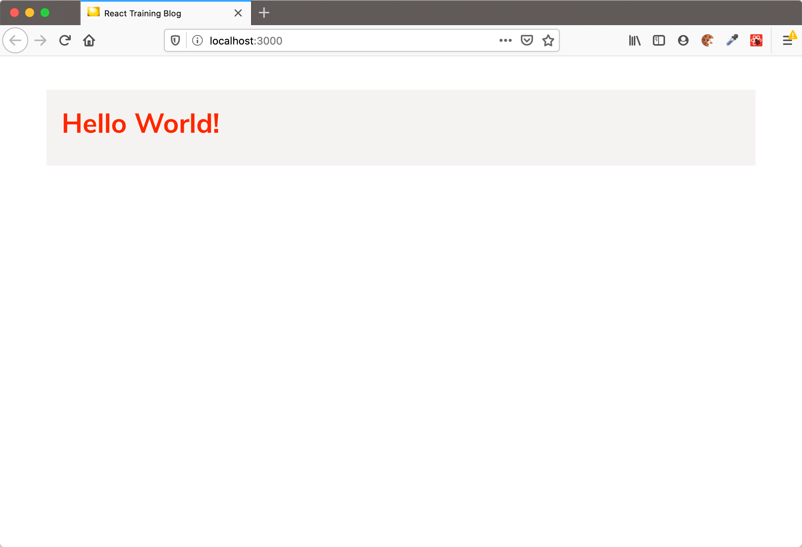

# Einrichten des Workspaces

## Voraussetzungen

Auf den Teilnehmer Laptops/PCs sollte installiert sein:

- Git (zum installieren des Workspaces)
- [NodeJS](https://nodejs.org/en/download/) (LTS version 12.14) und npm Version 6.13.x (ist in der NodeJS Distribution enthalten)
- Browser (am besten Firefox oder Chrome)
- Eine IDE oder ein Texteditor, zum Beispiel:
  - [Visual Studio Code](https://code.visualstudio.com/)
  - [IntelliJ IDEA](https://www.jetbrains.com/idea/download/) (Ultimate Edition, Evaluationsversion reicht aber)
  - [Webstorm](https://www.jetbrains.com/webstorm/download/) (Evaluationsversion reicht)

Die Laptops sollten _auch während des Trainings_ Internet-Zugang haben (s.u.)

Wenn die Teilnehmer bereits ihren "Lieblingseditor" verwenden, sollen sie diesen gerne weiterverwenden, dann müssen sie während des Trainings nicht auch noch einen neuen Editor erlernen.

**Optional: Browser Erweiterungen für React**

Ich würde empfehlen, die [React Developer Tools](https://github.com/facebook/react/tree/master/packages/react-devtools) zu installieren, die es für Firefox und Chome gibt.

## Schritt 1: Repository klonen und Pakete installieren

1. Das Repository klonen:

```
git clone https://github.com/nilshartmann/react-training
```

2. Testweise die benötigten npm-Pakete installieren:

```
cd blog-example/backend-rest
npm install

cd blog-example/workspace
npm install

cd blog-example/workspace-typescript
npm install
```

## Schritt 2: Testen, ob Backend funktioniert

1. Im Verzeichnis **blog-example/backend-rest** des Repositories das Backend starten:

```
cd blog-example/backend-rest
npm start
```

Achtung! Das Backend läuft auf **Port 7000**, d.h. dieser Port muss verfügbar sein.

2. Backend testen

- Im Browser (oder per curl, wget oder httpie) aufrufen: http://localhost:7000/posts
- Dort sollte JSON Code zurückkommen

## Schritt 3: Testen, ob das Frontend funktioniert

1. Frontend (Beispiel-Anwendung) starten

Dazu in das Verzeichnis `blog-example/workspace` wechseln und `npm start` ausführen:

```
cd blog-example/workspace

npm start
```

Achtung! Das Frontend läuft auf **Port 3000**, dh dieser Port muss verfügbar sein.

2. Wenn das Frontend gestartet ist, zum testen einmal die Anwendung im Browser aufrufen: [http://localhost:3000](http://localhost:3000). Dort sollte "Hello, World" erscheinen, dann ist der Workspace einsatzbereit.



## Internet-Zugang

Da wir vor und während des Trainings ggf. noch Aktualisierungen installieren müssen, bitte sicherstellen, dass auch während des Trainings **auf den Computern der Teilnehmer der Internet-Zugang (insb. git und npm) besteht und funktioniert!**

Informationen zum Einrichten eines Proxies für npm könnt ihr u.a. [hier finden](http://wil.boayue.com/blog/2013/06/14/using-npm-behind-a-proxy/).

Bei Fragen oder Problemen meldet Euch bitte bei mir.
