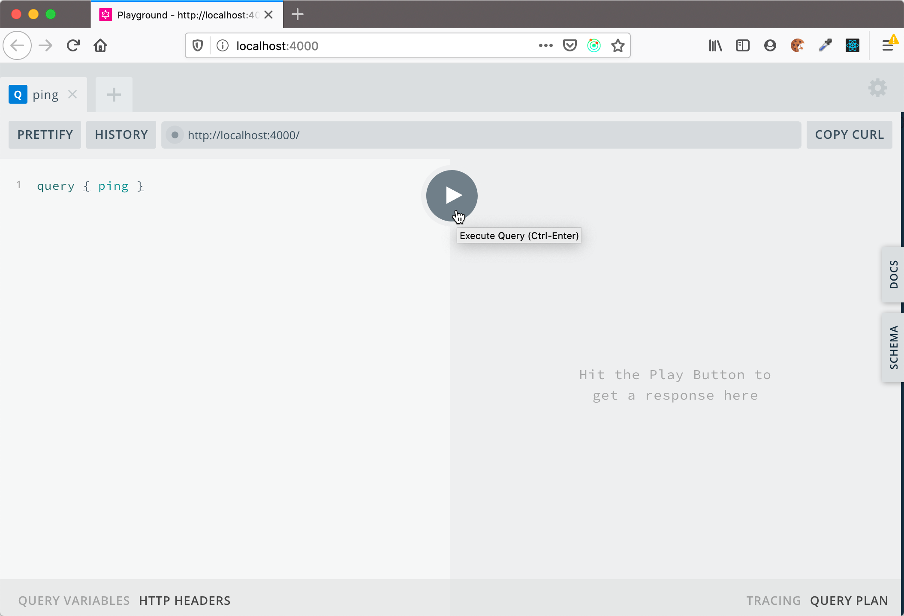

# Preparing the React Training Workspace

## Requirements

Please make sure, that the attendees' laptops have following softare installed:

- Git (in order to install the Workspace and pull updates)
- [NodeJS](https://nodejs.org/en/download/) (LTS version 12.14) und npm Version 6.13.x (part of the NodeJS distribution)
- Browser (Firefox or Chrome)
- An IDE or Editor of your choice, for example:
  - [JetBrains Webstorm](https://www.jetbrains.com/webstorm/download/) (evaluation version is sufficient)
  - [Visual Studio Code](https://code.visualstudio.com/)
- if the attendees have a preferred/know IDE or Editor they use it to avoid "fighting" with a new environment during the training.
- The computers should have working internet access _also during the training_

**Optional: Browser extensions**

- I would recommend to install the [React Developer Tools](https://github.com/facebook/react/tree/master/packages/react-devtools). They're available for [Chrome](https://www.google.com/url?sa=t&rct=j&q=&esrc=s&source=web&cd=1&cad=rja&uact=8&ved=2ahUKEwjE14vhq-rmAhVGblAKHbgOC1sQFjAAegQICRAK&url=https%3A%2F%2Fchrome.google.com%2Fwebstore%2Fdetail%2Freact-developer-tools%2Ffmkadmapgofadopljbjfkapdkoienihi&usg=AOvVaw3YJDg7kXgeeChgKN88s0Sx) and [Firefox](https://addons.mozilla.org/de/firefox/addon/react-devtools/)

- For developing with Apollo, I'd recommend to install [Apollo Client Tools](https://www.apollographql.com/docs/react/development-testing/developer-tooling/#apollo-client-devtools),
  which are available for [Chrome only](https://chrome.google.com/webstore/detail/apollo-client-developer-t/jdkknkkbebbapilgoeccciglkfbmbnfm)

## Step 2: Clone the Git Repository and install dependencies

1. Clone the repository:

```
git clone https://github.com/nilshartmann/react-training
```

2. Install NPM packages inside the following folders:

```
cd blog-example/backend
npm install

cd blog-example/backend-graphql
npm install

cd blog-example/workspace
npm install
```

## Step 2: Verify that the demo backend is running

1. Use npm to start the backend inside the `blog-example/backend` folder:

```
cd blog-example/backend
npm start
```

Attention! The backend process listens on **port 7000**. Please make sure that this port is available on your machine.

2. Test backend

- In your browser (or with curl, wget or httpie) open following URL: http://localhost:7000/posts
- If your receive JSON data everything is fine 😊

## Step 3: Verify, that the demo graphql backend is running.

1. Use npm to start the GraphQL backend inside the `blog-example/backend-graphql` folder:

```
cd blog-example/backend-graphql
npm start
```

Attention! The GraphQL server process listens on **port 4000**. Please make sure that this port is available on your machine.

2. Test GraphQL backend

- In your browser open following URL: http://localhost:4000
- The "GraphQL playground" should open
- Please enter on the left side the following GraphQL query: `query { ping }` and hit the run button (big arrow in the middle).
- The server should response with "Hello, World"
- Everything is fine!



## Schritt 3: Verify that the frontend example is working

1. Start the frontend

Run npm in the folder `blog-example/workspace`:

```
cd blog-example/workspace

npm start
```

Attention! The frontend is running on **Port 3000**. Please make sure, this port is available on your machine!

2. When the frontend runs, please open [http://localhost:3000](http://localhost:3000) in your browser. If you see "Hello, World", everything is ready! 🎉


## Internet access

As we probably have to install before and during the Training updates, please make sure, that your internet connection is working (esp. git and npm).

If your company is using a Proxy, you can find some informations how to use npm behind a proxy [here](http://wil.boayue.com/blog/2013/06/14/using-npm-behind-a-proxy/).

If you have any problems or question, please let me know!
